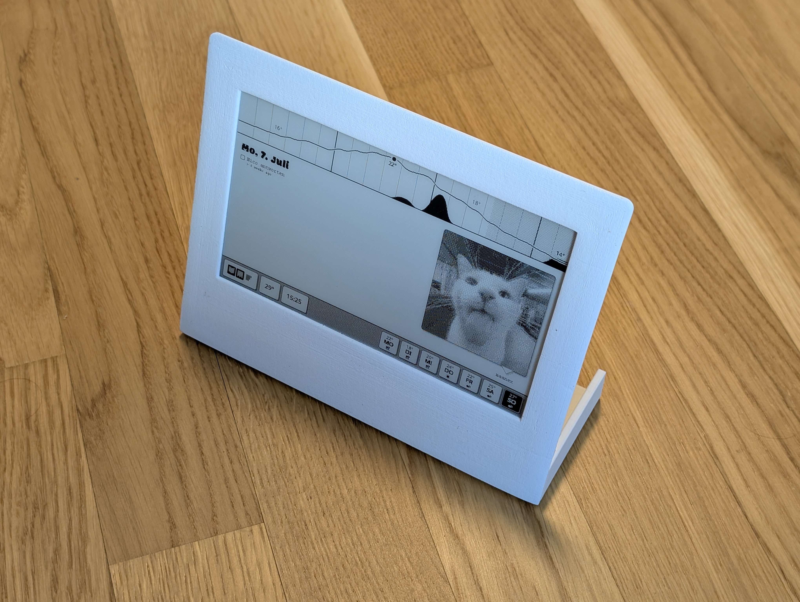

# Screenshot




## Protocol

```
    Op Code       Op Payload
     ┌┴┐          ┌──┴──── ─ ─
11101000 00000000 00000000 ...
└─┬─┘    └──┬───┘
Header   Sleep Minutes
```

#### `0b000` **NOOP**: Do nothing

#### `0b001` **FULL**: Full update, payload is image data from top left to bottom right

#### `0b010` **PART**: Partial update,
- First 8 byte define the update bounding box from top left corner
- Then 2 byte previous image block size = J
- Then J bytes previous image data
- Then ? bytes updated image data in bounding box
```
      Y-Pos       Height      Previous Image Data
      ┌─┴─┐       ┌─┴─┐       ┌──┴───┐
FF FF FF FF FF FF FF FF FF FF FF .. FF  FF .. FF
└─┬─┘       └─┬─┘       └─┬─┘           └──┬───┘
X-Pos       Width       Next Block Len  Updated Image Data
```
