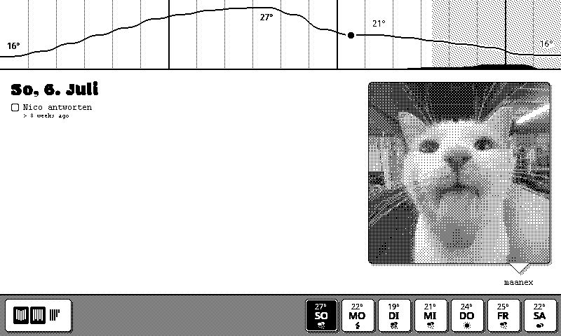

# Screenshot

# BASE -> ESP

## epddash/up/full

full screen update

## epddash/up/part

partial screen update

# ESP -> BASE

## epddash/stat

epddash status. values:
- `hello` booted
- `bye` planned shutdown
- `require_full` screen requires full refresh 

